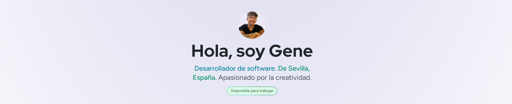

- 🔭 Ahora mismo estoy trabajando voluntariamente en [Petinder](https://petinder.online) como desarrollador

- 🌱 En estos momentos me encuentro masterizando **Java**

- 👨‍💻 Puedes encontrar mis proyectos en mi portfolio [https://genewg.netlify.app](https://genewg.netlify.app)

- 📫 Contacta conmigo **genewitsman2003@gmail.com**

  
## 🔧 Lenguajes y herramientas

      

## 🌟 Sobre mí
- 🎓 Grado Superior de DAM en IFP Innovación en Formación Profesional
- 🎨 Intereses: Inteligencia Artificial (IA), Experiencia de Usuario (UX), Bases de Datos
- 🏋 Como hobby me gusta el gimnasio y la alimentación 
- 🌍 Mi sueño es viajar el mundo

## 📫 Contacto

  
  

---

### ¡Gracias por tomarte el tiempo para saber sobre mí! :)
P.D. Me encantan los perritos

  

